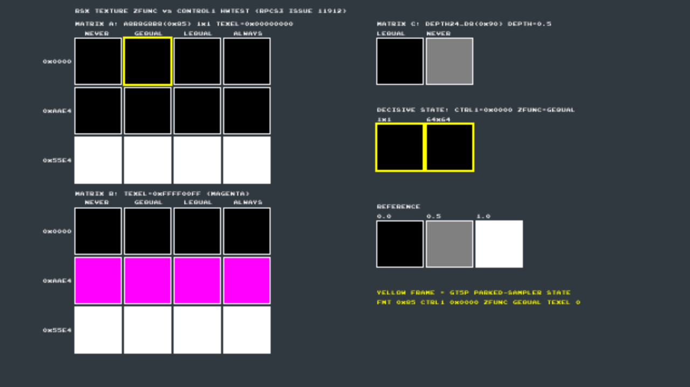

# rsx-zfunc-hwtest

PS3 homebrew test binary for [RPCS3 issue #11912](https://github.com/RPCS3/rpcs3/issues/11912)
(GT5P road flicker). It settles one question on real hardware:

> **Does real RSX apply the texture `zfunc` depth-compare to color-format fetches?**

RPCS3 reads `tex.zfunc()` only when the texture format is depth-class
(`RSXThread.cpp`), so for color textures the compare never happens. During dim
frames GT5P parks the track shaders' shadow sampler on a 1×1 A8R8G8B8 texture
with `CONTROL1 = 0x00000000` **and `zfunc = GEQUAL`**, texel `0x00000000`.
Under RPCS3's decode that state samples 0.0 → the track renders black
(the flicker). Real consoles render it lit. The hypothesis under test: RSX
honors the `zfunc` compare regardless of format class, so the parked fetch
resolves as an always-passing compare → 1.0.

One photo of the TV answers it.

## What it draws

Every swatch is drawn by the same trivial fragment program
(`oColor = tex2D(sampler0, uv)`); only the texture-unit state varies per cell.
The implicit compare reference is 0.0 (the shader forwards a float2 texcoord,
so the r/q components are 0).

- **MATRIX A** — A8R8G8B8 (raw fmt byte `0x85`, swizzled) 1×1, texel `0x00000000`.
  Rows: `CONTROL1` low word `0x0000` / `0xAAE4` (pass-through) / `0x55E4` (ONE).
  Columns: `zfunc` NEVER / **GEQUAL** / LEQUAL / ALWAYS.
  The `0x0000`×GEQUAL cell (yellow frame) is the exact GT5P parked state — the
  **decisive cell**.
- **MATRIX B** — same grid, texel `0xFFFF00FF` (magenta). Makes the CONTROL1
  per-channel-control semantics visible at a glance and must reproduce the
  established behavior on BOTH platforms: `0x0000` row black, `0xAAE4` row
  magenta, `0x55E4` row white. If these rows are wrong anywhere, the harness
  is buggy — stop and debug, don't interpret.
- **MATRIX C** — DEPTH24_D8 (raw `0x90`) 1×1, depth = 0.5, zfunc LEQUAL vs
  NEVER: the classic depth-compare case, anchoring that the harness plumbing
  and the compare path work at all.
- **SIZE** — the decisive state at texture size 1×1 **and** 64×64 (rules out
  degenerate-descriptor effects).
- **REF** — solid 0.0 / 0.5 / 1.0 texels through pass-through remap.

The full cell map (format/CONTROL1/zfunc/size/position per cell) is printed on
the TTY at boot — see [rpcs3-reference-tty.log](rpcs3-reference-tty.log).

## Predictions

| Cell | RPCS3 (measured, see below) | Real PS3 if hypothesis TRUE | Real PS3 if hypothesis FALSE |
|---|---|---|---|
| **A `0x0000`×GEQUAL (decisive)** | **black** | **non-black (expected white)** | black |
| A `0x0000`×NEVER | black | black | black |
| A `0x55E4` row | white | white in NEVER col; compare-driven elsewhere | white |
| B `0x0000` row | black | black in NEVER col | black |
| B `0xAAE4` row | magenta | magenta in NEVER col | magenta |
| B `0x55E4` row | white | white in NEVER col | white |
| SIZE 1×1 / 64×64 | black / black | non-black / non-black | black / black |

Notes:
- GEQUAL is the decisive column because texel = 0 and ref = 0: `0 ≥ 0` passes
  under **either** operand orientation, so the prediction does not depend on
  which way RSX orients the compare.
- The hypothesis says nothing about zfunc = NEVER (0): games sample color
  textures with a zeroed zfunc constantly, so NEVER must behave as
  compare-off. The parked GT5P state specifically programs GEQUAL (its 16×16
  partner state on the same TIU reads NEVER).
- MATRIX C on RPCS3 0.0.41 renders LEQUAL = black, NEVER = gray (raw 0.5):
  RPCS3 orients the depth compare as `texel op ref` and treats NEVER as
  compare-off. Whatever hardware shows here is anchor data, not a verdict.
- If the decisive cell is black on hardware, the hypothesis is dead and we
  retract upstream.

## RPCS3 reference (same binary)



- Stock **RPCS3 v0.0.41** (macOS arm64, official build, Vulkan/MoltenVK) — not
  the ETK fork, so no fork decode patches are in play.
- Booted `rsx-zfunc-hwtest.self` directly (`rpcs3 --no-gui <path>`).
- The image is not a window screenshot: the binary dumps its own back buffer
  to `/app_home/rpcs3_framedump.bmp` after 90 frames (pixel-exact). For that
  dump to contain the frame, RPCS3 needs `Write Color Buffers: true`
  (Advanced tab) — the setting only makes the framebuffer CPU-visible; the
  rendered output is identical either way. On-screen output does not need it.

## Running it

**Real PS3 (PS3HEN):** install `rsx-zfunc-hwtest.pkg` from HEN's Package
Manager (it's a fakeNPDRM retail-format package; HEN installs these), then
launch **RSX zfunc-remap hwtest** from the XMB Game column. Alternatively boot
`rsx-zfunc-hwtest.self` directly, or `ps3load` the `.elf`. The scene is
static; photograph the TV so the yellow-framed cells and the B matrix are
legible. CROSS exits. See [PS3HEN-SETUP.md](PS3HEN-SETUP.md) for console prep.

**RPCS3:** File → Boot → `rsx-zfunc-hwtest.self` (the `.pkg` is for real
hardware; on RPCS3 boot the SELF directly).

Do **not** boot a raw ELF relinked from the objects without running psl1ght's
`sprxlinker` on it — the raw linker output has an empty PRX stub table and
dies at a null call in crt. The shipped `.elf` here is the stripped,
sprxlinker-fixed one the Makefile produces under `build/`.

## Building (deterministic)

```sh
./build.sh
```

See the header of [build.sh](build.sh) for the pinned toolchain image digest
and the NVIDIA Cg toolkit note (cgcomp needs x86 `libCg.so`, fetched
separately, never redistributed).

**Reproducibility boundary:** the **ELF is bit-reproducible** — same source +
pinned toolchain → identical ELF every build, so it's the meaningful
verification anchor. The CEX `.self` (and the `.pkg`/`.gnpdrm.pkg` wrapping it)
are re-signed by `make_self` with a fresh seed each run, so their hashes are
**not** stable across builds; they identify the specific shipped copies below,
not a reproducibility target. The `.fake.self` (fself) is deterministic.

```
277f91644afb0c61396eff4e9cd9f771e9990c6e00d1df685952ab82cfe0fd85  rsx-zfunc-hwtest.elf          (reproducible)
83a238fe4d066f74bc48cd3cc51c17bff783df09ea8d16258854cd2219e517d9  rsx-zfunc-hwtest.fake.self    (reproducible)
451190cb454e9faac57c34f84249bb70a17f8881364f4b55828c8f6e91a0959c  rsx-zfunc-hwtest.self         (this copy)
6702741bcd9601c7b051723fa63e53a8962116adb048aa2b11d7772582c0298a  rsx-zfunc-hwtest.pkg          (this copy)
```

(`make pkg` also emits a `.gnpdrm.pkg` retail-finalized variant; ship the
plain `.pkg` for HEN. The ELF wrapped inside every variant is the reproducible
one above.)

## Register-level facts used

Per-TIU method registers (`+ index*8` words):

| Register | Offset | Field |
|---|---|---|
| `SET_TEXTURE_FORMAT` | `0x1a04` | bits[15:8] fmt byte: A8R8G8B8=`0x85`, DEPTH24_D8=`0x90` |
| `SET_TEXTURE_ADDRESS` | `0x1a08` | bits[31:28] zfunc: 0=NEVER … 3=LEQUAL … 6=GEQUAL, 7=ALWAYS |
| `SET_TEXTURE_CONTROL1` | `0x1a10` | low word: bits[7:0] crossbar (`0xE4` identity), bits[15:8] per-channel control (0=ZERO, 1=ONE, 2=REMAP) |

psl1ght writes `gcmTexture.remap` verbatim to CONTROL1 and exposes zfunc as an
`rsxTextureWrapMode()` argument (`librsx`: `LoadTexture → NV40TCL_TEX_SWIZZLE`,
`TextureWrapMode → zfunc << 28`), so no raw FIFO pokes are needed.

## Provenance

Skeleton derived from the PSL1GHT `rsxtest` and `debugfont_renderer` samples
(ps3dev/PSL1GHT), adapted to the classic psl1ght API of the pinned toolchain.
All test textures are constant-fill, so swizzled-vs-linear layout is
irrelevant and the raw format byte matches the guest state exactly.
